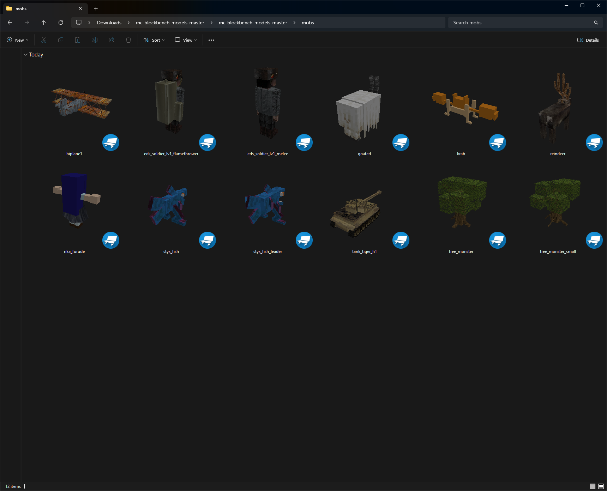

# glimpse

A Windows Shell Extension that shows thumbnail previews of 3D model files directly in File Explorer. Supports glTF/GLB, Wavefront OBJ, Blockbench, Minecraft Java/Bedrock, and Vintage Story formats.


## Supported Formats

| Format | Extensions | Description |
|--------|-----------|-------------|
| **glTF / GLB** | `.gltf`, `.glb` | Industry-standard 3D transmission format |
| **Wavefront OBJ** | `.obj` | Widely supported 3D model format with .mtl material support |
| **Blockbench** | `.bbmodel` | Blockbench model format used for Minecraft modding and more |
| **Minecraft Bedrock** | `.json` | Bedrock Edition geometry format (`minecraft:geometry`) |
| **Minecraft Java** | `.json` | Java Edition block/item model format |
| **Vintage Story** | `.json` | JSON-based model format used by Vintage Story |

### JSON Format Detection

Multiple formats share the `.json` extension. glimpse identifies them by unique content markers:

| Format | Detection Key |
|--------|--------------|
| Blockbench | `.bbmodel` extension, or `"meta"` + `"format_version"` in content |
| Minecraft Bedrock | `"minecraft:geometry"` key |
| Minecraft Java | `"parent"` field (e.g. `"block/block"`) with `"elements"` |
| Vintage Story | `"elements"` with cube faces and `"from"`/`"to"` (fallback) |

## Features

- **Native Explorer Integration** — Thumbnails appear just like images, videos, and other supported formats
- **Texture Support** — Renders embedded textures (glTF, Blockbench), companion .mtl textures (OBJ), and asset tree textures (Vintage Story)
- **Vertex Colors** — Displays models with vertex color attributes (glTF)
- **Material Colors** — Reads diffuse colors from .mtl materials (OBJ)
- **Asset Tree Resolution** — Vintage Story models resolve textures from the `assets/*/textures/` directory hierarchy
- **Multiple Formats** — 7 format variants across 4 file extensions
- **Software Rendering** — No GPU required, works in VMs and remote desktop
- **Lenient Parsing** — Gracefully handles files with missing textures by rendering geometry with solid color

## Screenshot



Models shown are from [FrenchKrab/mc-blockbench-models](https://github.com/FrenchKrab/mc-blockbench-models).

## How It Works

glimpse is a COM DLL implementing Windows' [`IThumbnailProvider`](https://learn.microsoft.com/en-us/windows/win32/api/thumbcache/nn-thumbcache-ithumbnailprovider) interface. When Explorer encounters a supported model file:

1. Windows loads our DLL and passes the file data
2. We auto-detect the format (by extension and content analysis) and parse the model
3. A software rasterizer renders the scene with:
   - Automatic camera framing based on bounding sphere
   - Flat shading with ambient + diffuse + specular lighting
   - Z-buffer depth testing
   - Per-pixel texture sampling with barycentric UV interpolation
4. The resulting bitmap is returned to Explorer

### Format-Specific Details

- **glTF/GLB** — Parsed via the [`gltf`](https://crates.io/crates/gltf) crate. Supports embedded textures, vertex colors, and scene graph traversal.
- **Wavefront OBJ** — Parsed via [`obj-rs`](https://crates.io/crates/obj-rs). Loads companion `.mtl` files for diffuse colors (`Kd`) and textures (`map_Kd`). Handles N-gon faces via fan triangulation.
- **Blockbench** — Parsed via `serde_json`. Supports embedded base64 textures, element hierarchy, and both Java Block and Free/Bedrock rotation orders.
- **Minecraft Bedrock** — Bone-based hierarchy with pivot rotations. Cubes use `origin`/`size` with per-face UV objects supporting `uv_size` mirroring and `uv_rotation`.
- **Minecraft Java** — Elements with `from`/`to` bounds and single-axis rotation. UV space defined by `texture_size` (default 16x16).
- **Vintage Story** — JSON5 with comments. When loaded from a VS asset tree, resolves textures from `assets/*/textures/` directories, preferring the same domain. Supports `textureSizes` for per-texture UV normalization.

## Installation

Download `glimpse-setup.exe` from the [releases page](https://github.com/codename-B/glimpse/releases) and run it. See [INSTALLER.md](INSTALLER.md) for details.

### Building from Source

**Prerequisites:** [Rust](https://rustup.rs/) with `stable-x86_64-pc-windows-msvc` toolchain.

```powershell
cargo build --release
```

This produces `target/release/glimpse.dll`.

### CLI Testing Tool

A command-line tool is included for testing format support without installing the shell extension:

```powershell
cargo build --release
target/release/glimpse-cli.exe model.gltf 256
```

This renders a 256x256 thumbnail and saves it as a PNG next to the input file.

## Limitations

| Limitation | Description |
|------------|-------------|
| **Triangles Only** | Line, point, and strip primitives are skipped |
| **No Animation** | Static pose only (no skinning, morphs, or animation) |
| **External Resources** | glTF files referencing external .bin render geometry only |
| **CPU Rendering** | Fast for thumbnails but not real-time |

## Dependencies

- [`gltf`](https://crates.io/crates/gltf) — glTF 2.0 parsing
- [`obj-rs`](https://crates.io/crates/obj-rs) — Wavefront OBJ/MTL parsing
- [`serde` / `serde_json`](https://crates.io/crates/serde_json) — JSON parsing for Blockbench and Minecraft formats
- [`json5`](https://crates.io/crates/json5) — Vintage Story JSON5 parsing
- [`glam`](https://crates.io/crates/glam) — Math library for matrix/vector operations
- [`base64`](https://crates.io/crates/base64) — Data URI decoding
- [`image`](https://crates.io/crates/image) — PNG/JPEG texture decoding
- [`windows`](https://crates.io/crates/windows) — Windows API bindings

## Contributing

Contributions welcome! Please open an issue or PR.

## License

MIT License — see [LICENSE](LICENSE) for details.
